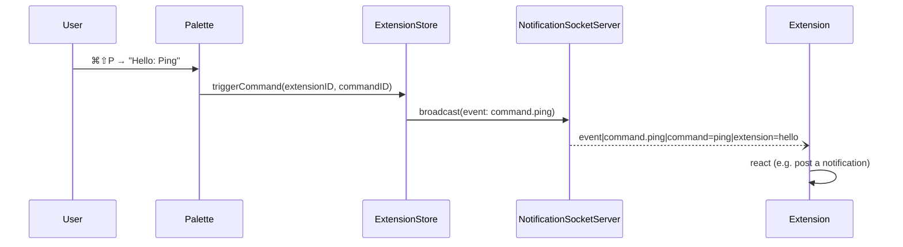

# Palette Commands

Extensions can declare commands that appear in Muxy's command palette. Selecting a command fires a `command.<id>` event back to the extension.

```json
{
  "commands": [
    { "id": "ping", "title": "Hello: Ping", "subtitle": "Demo command" },
    {
      "id": "open-pr",
      "title": "Open PR…",
      "action": { "kind": "openTab", "tabType": "pr-viewer" }
    }
  ]
}
```

## Fields

| Field | Type | Required | Notes |
| --- | --- | --- | --- |
| `id` | string | yes | Stable per extension. Used to form the event name `command.<id>`. |
| `title` | string | yes | Shown as the palette row title. |
| `subtitle` | string | no | Shown as a dimmer second line. Defaults to the extension's display name. |
| `action` | object | no | What happens when the command is picked. Defaults to `{ "kind": "event" }`. |

## Actions

| Kind | Behavior | Extra fields |
| --- | --- | --- |
| `event` | Broadcasts `command.<id>` over the socket. Default if `action` is omitted. | — |
| `openTab` | Opens an extension webview tab of the named type. | `tabType` (required, must reference a declared [tab type](tabs.md)); `data` (optional JSON merged into `window.muxy.data`). |
| `togglePanel` | Toggles an extension [panel](panels.md) open/closed. | `panel` (required, must reference a declared panel id). |
| `openPopover` | Toggles an extension [popover](popovers.md) anchored to its topbar/status bar item. | `popover` (required, must reference a declared popover id). |
| `runScript` | Runs the script in a JavaScriptCore context with the same `muxy.*` API as webview tabs (no DOM). Read the [Scripts](scripts.md) page. Requires `commands:run-script`. | `script` (required, relative path within the extension directory). |

## How it surfaces

Extension commands appear in the **Custom Commands** scope of the omnibox (default `⌘⇧P`), under their own **Extension Commands** section. They are searchable by extension name, title, and subtitle.



## Reacting to a command

The extension must subscribe to its own command event. The command id auto-allowlists the corresponding `command.<id>` event — you do **not** need to add it to the manifest `events` array.

```bash
identify|hello|"$MUXY_EXTENSION_TOKEN"
subscribe|command.ping
```

When the palette item is picked, the extension receives:

```
event|command.ping|command=ping|extension=hello
```

## Permissions

There is no `commands:*` permission. Registering a command is free; reacting to it requires whatever permissions the reaction itself needs (e.g. `notifications:write` to post a toast back, or `panes:write` to open a split).

## Limits and gotchas

- Disabled extensions do not contribute commands.
- Commands disappear from the palette as soon as the extension is toggled off in Settings.
- Command titles are not deduplicated across extensions; two extensions can register a command titled `Build`. Use a prefix (`MyExt: Build`) to disambiguate.
