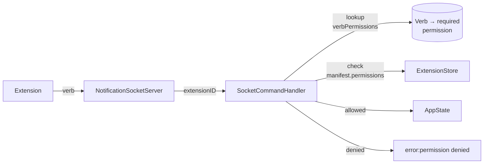

# Permissions

Muxy enforces two layers for every extension call:

1. **Manifest permissions** — declared in `permissions`, checked at the socket / webview / script boundary. Calling a verb without its permission returns `error:permission denied (<perm>)`.
2. **Runtime consent** — for verbs that run code or touch terminal contents (`exec`, `panes.send`, `panes.sendKeys`, `panes.readScreen`), the user is prompted at runtime even when the manifest permission is granted. The decision can be remembered as a rule.

Permissions are not enforced for **unidentified** socket clients (e.g. the `muxy` CLI). They only apply once a session has run `identify|<extension-id>`.

## Available permissions

| Permission | Grants |
| --- | --- |
| `panes:read` | `read-screen`, `list-panes` |
| `panes:write` | `split-right`, `split-down`, `send`, `send-keys`, `close-pane`, `rename-pane` |
| `tabs:read` | `list-tabs` |
| `tabs:write` | `switch-tab`, `new-tab`, `next-tab`, `previous-tab`, `open-tab` |
| `projects:read` | `list-projects` |
| `projects:write` | `switch-project` |
| `worktrees:read` | `list-worktrees` |
| `worktrees:write` | `create-worktree`, `switch-worktree`, `refresh-worktrees` |
| `notifications:write` | Post notifications via `type\|paneID\|title\|body` |
| `panels:write` | `panel.open`, `panel.toggle`, `panel.close` — open and close the extension's declared [panels](panels.md); `popover.resize`, `popover.close` — size and dismiss the extension's open [popover](popovers.md). |
| `commands:run-script` | Execute `runScript` palette command actions in the per-extension JavaScriptCore context. |
| `commands:exec` | Run shell commands via `muxy.exec` (subprocess execution with stdout/stderr capture). |

## Runtime consent

The following verbs prompt the user at runtime, even if the manifest permission is granted:

| Verb | Reason |
| --- | --- |
| `exec` | Launching a subprocess on the user's machine. |
| `panes.send` | Typing arbitrary text into an active terminal. |
| `panes.sendKeys` | Pressing keys (including Ctrl+C, Enter) in an active terminal. |
| `panes.readScreen` | Reading the visible contents of a terminal. |

The prompt shows the extension, the verb, and the literal payload (full argv, the keystroke, or the pane id). The user picks:

- **Allow & remember** — runs the call and writes an allow rule.
- **Allow** — runs this one call, asks again next time.
- **Cancel** — denies this one call, asks again next time.
- **Deny & remember** — denies and writes a deny rule.

If the user takes longer than 60 seconds, the call is denied automatically.

Rules live in `~/Library/Application Support/Muxy/extension-grants.json` (Muxy-owned — extensions cannot self-grant). Every gated call appends an entry to `~/Library/Application Support/Muxy/extension-audit.log` (`Settings → Extensions → Permissions → Reveal Audit Log`).

### Default "remember" patterns

| Verb | Pattern saved |
| --- | --- |
| `exec` (argv) | `argvPrefix` of the base command only. Allowing `git status` also allows other `git` subcommands. |
| `exec` (shell form) | `shellExact` of the full shell string. |
| `panes.*` / `tabs.openForeign` | `any` for that verb. Pane and tab targets are per-session, so the grant covers any future target. |

Rules can be reviewed, refined, or removed in `Settings → Extensions → Permissions`. Deny rules win over allow rules; more specific patterns win over less specific ones.

## Abuse handling

An identified extension that posts notifications without `notifications:write` has each attempt dropped and logged. After 100 dropped attempts on the same connection, the session is disconnected. The extension can reconnect, but the counter resets only on a new socket connection.

## What permissions don't gate

- **Subscribing to events** is gated separately by the manifest `events` array — see [Events](events.md). The connection's identity, not a `permissions` entry, decides what events it can subscribe to.
- **Receiving palette command triggers.** Once an extension declares a command in `commands`, it can subscribe to its own `command.<id>` event without listing it under `events`.
- **AI provider routing.** Declaring `aiProvider` in the manifest is enough; there is no separate permission today.

## Granularity & versioning

Permissions are coarse (verb groups, not individual verbs) on purpose: the API is in flux, and finer grain locks us into a wire format we may want to change. Expect this list to expand and possibly split (e.g. `panes:send` vs `panes:close`) once a dedicated extension API layer lands.
