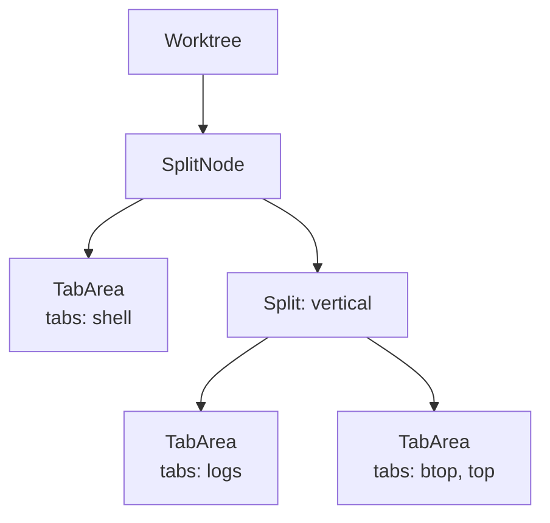

# Tabs & Splits

Every Muxy worktree owns a tree of split panes; each leaf pane holds a stack of tabs.

Splits nest arbitrarily — the layout is a binary tree of horizontal and vertical splits.

## Tab kinds

| Kind | What it is |
| --- | --- |
| Terminal | A libghostty-powered terminal (the default) |
| Browser | A built-in browser tab |
| Extension | A tab rendered by an installed extension |

## Creating tabs

| How | Result |
| --- | --- |
| `⌘T` | New terminal tab |
| File menu → New Tab | New tab in the active pane |

## Renaming, pinning, coloring

- **Rename Tab** — double-click the tab title (or bind a shortcut in Settings → Keyboard Shortcuts; unbound by default).
- **Pin / Unpin** — right-click the tab → **Pin** (or bind a shortcut; unbound by default). Pinned tabs stay leftmost.
- Right-click → **Color** to apply an accent.
- Right-click → **Close Others / Close to the Left / Close to the Right**.

Custom titles and colors are saved in the workspace snapshot and survive worktree switches.

## Splits

| Action | Shortcut |
| --- | --- |
| Split Right | `⌘D` |
| Split Down | `⌘⇧D` |
| Close Pane | `⌘⇧W` |
| Focus Pane | `⌘⌥←/→/↑/↓` |
| Toggle Maximize Pane | `⌘⌥↩` |
| Cycle Tab (All Panes) | `⌃Tab` / `⌃⇧Tab` |

## Maximize pane

Use the maximize button in a pane's tab strip, or press `⌘⌥↩`, to temporarily focus that pane in a split workspace. Press the same shortcut or the restore button to show the full split tree again.

Maximize is available only when the worktree has multiple panes. Moving focus to another pane or splitting the maximized pane restores the full layout.

## Drag and drop

Tabs can be dragged within a pane to reorder, between panes to move, or onto a pane edge to create a new split.

## Tab Focused layout

Choose **Tab Focused** under **Settings → Interface** to move tab navigation into the left sidebar. The sidebar groups open tabs by project, keeps projects without tabs visible and expandable without an empty placeholder, preserves project switching on `⌃1…9`, and shows tab shortcuts for the first nine open tabs.

The title bar shows the active project name while tab navigation remains in the sidebar. The bottom status bar exposes these repository controls for the active worktree in both layouts:

- The branch control shows the active branch and upstream ahead/behind counts. Opening it refreshes the searchable branch list; select a branch to switch, create and immediately switch to a new branch from the current HEAD, or hover a non-current branch to permanently delete the local branch after inline confirmation. Unmerged local commits may become unreachable; remote branches are unaffected. Git continues to protect the current branch and branches checked out in another worktree.
- The changes control shows whether the working tree is clean and how many files changed. Open it to inspect staged, unstaged, and conflicted files with their added and removed line counts; stage or unstage individual files or each full section; or discard an unstaged file after confirmation. File rows render lazily, and bounded untracked line counts load only as their rows become visible so large worktrees do not block the interface.
- When the current branch has a GitHub pull request, the PR control shows its number and check health. Open it to inspect mergeability and checks, update a behind branch, choose a merge method, merge or close the PR, or open it on GitHub. Merge and close actions use a five-second inline confirmation; click the armed action again to run it immediately, or use its Cancel control to stop it.
- **Commit** stages all changes, asks the configured AI CLI for a commit message in the background, then commits and pushes through Muxy's Git service. The provider runs non-interactively with repository-writing tools disabled; it never receives control of the Git workflow. The control is disabled for clean worktrees and detached HEADs.
- **Create PR** appears only after Muxy confirms the branch has no pull request. It is disabled when the working tree is clean. The configured AI CLI generates a title, summary, new branch name, and target branch as JSON. Muxy validates that metadata, creates the branch, commits staged changes, pushes, and creates the pull request through its existing GitHub service.
- Use the dropdown attached to either button to choose its provider or keep **Auto**, which selects the first available supported CLI. The Create PR dropdown also edits a prompt override for the current project; removing the override returns that project to the global prompt under **Settings → AI**. No terminal tab is opened, and repository-changing controls remain disabled until the native workflow finishes.
- Status bar controls remain ordered as Branch, Changes, Commit, then pull request, with a separator between each control. Branch, Changes, and disabled Commit controls appear immediately without a loading indicator. After pull request lookup finishes, the final position shows either **Create PR**, pull request information, or a retry control.
- **Remove worktree** appears inside the changes dropdown only for secondary worktrees. The primary worktree cannot be removed.
- Pull request information and actions require an installed and authenticated `gh` CLI.

## Navigation history

Mouse side buttons (3 / 4) and three-finger horizontal trackpad swipes navigate Back / Forward through tab history. Keyboard equivalents: `⌘⌃←` / `⌘⌃→`.

## Persistence

The tab and split tree per worktree is saved automatically in `~/Library/Application Support/Muxy/workspaces.json`. Muxy restores tabs, split structure, titles, colors, pins, and working directories when it can recreate the workspace.

Use [Layouts](../layouts/overview.md) for reusable presets you want to keep in a repo and apply on demand.
