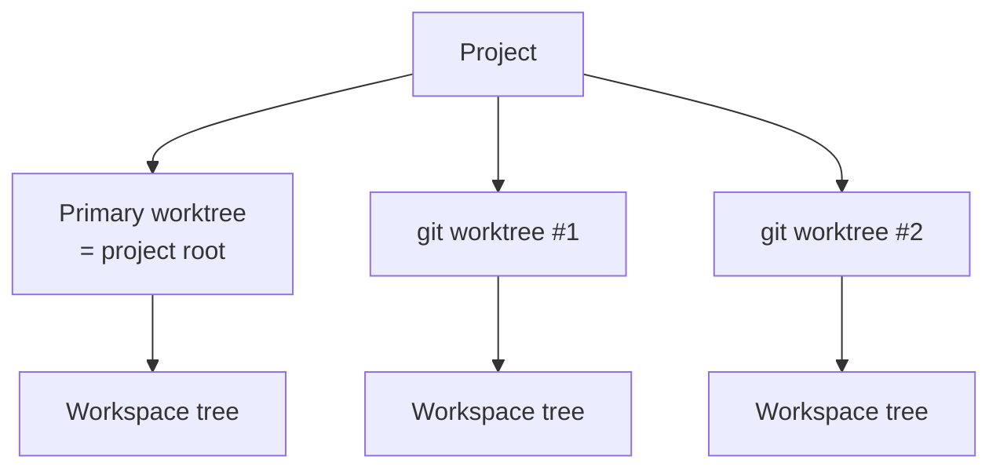

# Worktrees

Every project starts with a primary worktree (the project root). Git projects can attach more — each worktree has its own tabs, splits, and active selection.



## Worktree picker

Use the active project's worktree rows in the sidebar to:

- See all known worktrees and their branches.
- Create a new git worktree.
- Refresh the list (picks up worktrees created externally with `git worktree add`).

In Tab Focused layout, worktrees appear directly beneath their project. Repository and pull-request status for the selected worktree remains available in the bottom status bar in either layout.

## Creating a worktree

The **New Worktree** sheet asks for:

| Field | Notes |
| --- | --- |
| Branch | Existing branch, or a new branch name |
| Base | Ref to branch from (when creating a new branch) |
| Path | Where the worktree directory should live |

Muxy runs `git worktree add` and registers the new worktree with the project.

## Setup & teardown commands

Drop a `.muxy/worktree.json` at the **source project root** (the primary worktree) to script the lifecycle of ephemeral worktrees. The file is only read from the project root — copies inside individual worktrees are ignored. One config governs every worktree spawned from that project.

```json
{
  "setup": [
    "npm install",
    { "name": "Migrate DB", "command": "bundle exec rake db:migrate" }
  ],
  "teardown": [
    "docker compose down",
    "rm -rf .cache"
  ]
}
```

Each entry is either a plain command string or `{ "name", "command" }`.

**Setup** runs when the first tab is created in a freshly added worktree — use it to install dependencies, seed data, etc.

**Teardown** runs when you remove a worktree from Muxy. A sheet streams stdout/stderr live; the worktree directory is only deleted after every command exits `0`. If any command fails, removal is aborted, the error is surfaced, and the worktree stays on disk so you can investigate.

Setup commands run in the worktree directory under your login shell.

Teardown commands also run in the worktree directory under your login shell, with these extra environment variables:

| Variable | Value |
| --- | --- |
| `MUXY_WORKTREE_PATH` | Absolute path to the worktree |
| `MUXY_WORKTREE_NAME` | Worktree name as shown in Muxy |
| `MUXY_WORKTREE_BRANCH` | Checked-out branch (empty if detached) |

Externally managed worktrees (added with `git worktree add` outside Muxy) skip teardown during project cleanup, so Muxy will not run scripts against directories it did not create as part of bulk cleanup. Explicitly removing a discovered worktree from Muxy removes that git worktree through the app's normal removal flow.

## Persistence

Per-project worktree records live at `~/Library/Application Support/Muxy/worktrees/<projectID>.json`. Removing a project also removes its Muxy-owned worktree records and cleanup targets. Externally discovered worktrees are skipped by project cleanup.

## Notes

- Switching worktrees does **not** kill running terminals — they stay alive; you just see a different worktree's tabs.
- Remove the active secondary worktree from the changes dropdown in the bottom status bar. Removal still runs any configured teardown commands and warns before discarding uncommitted changes.
- The primary worktree (project root) is always present and cannot be deleted from Muxy.
