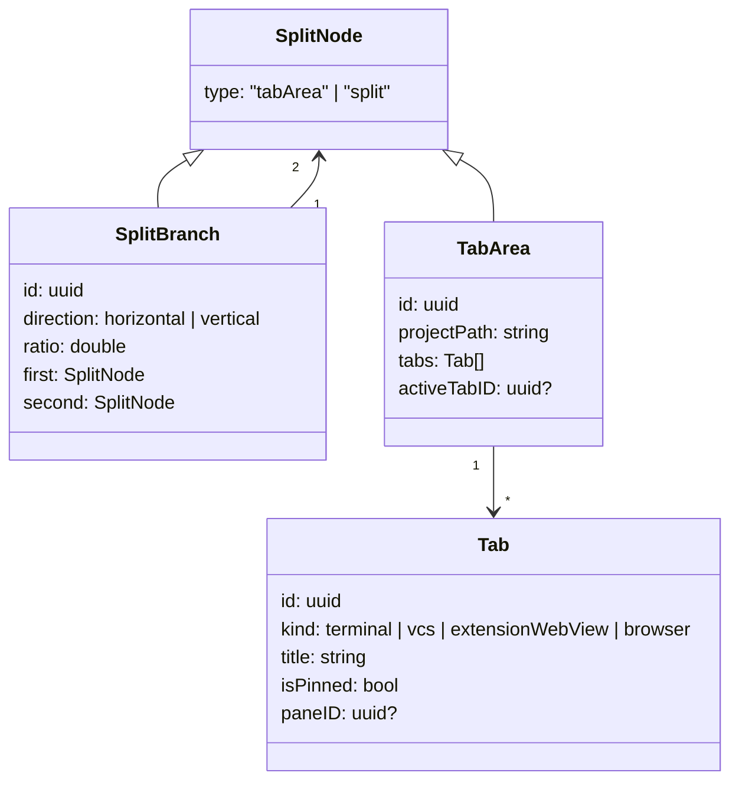

# Data Objects

Every object below is the exact wire shape produced by the desktop. All dates are ISO 8601, all IDs are UUID strings, and colors are unsigned 32-bit integers in `0xRRGGBB` form.

## Project

```json
{
  "id": "uuid",
  "name": "muxy",
  "path": "/Users/example/project",
  "sortOrder": 0,
  "createdAt": "2026-04-19T10:00:00Z",
  "icon": "hammer",
  "logo": "a1b2c3d4",
  "iconColor": "#7C3AED",
  "preferredWorktreeParentPath": "/Users/example",
  "worktreesEnabled": false,
  "workspaceKind": "local",
  "workspaceID": "uuid",
  "workspaceName": "Production"
}
```

`icon`, `logo`, `iconColor`, and `preferredWorktreeParentPath` are optional and omitted when unset. `icon` is an SF Symbol name. `logo` is an opaque storage identifier — fetch the image with [`getProjectLogo`](methods.md). `iconColor` is a hex string or a palette id (`red`, `blue`, `violet`, …). `worktreesEnabled` indicates whether the project exposes its worktrees in the sidebar; it defaults to `false`.

`listProjects` returns projects from **all** workspaces — local projects plus every remote (SSH) workspace's projects. `workspaceKind` is `"local"` or `"ssh"`; `workspaceID`/`workspaceName` identify the owning workspace. Ungrouped local projects and Home belong to the implicit **Local** workspace and carry its `workspaceID`. Selecting an `ssh` project via [`selectProject`](methods.md) makes the Mac activate that workspace and connect over SSH, so the mobile client drives the remote server transparently — terminals, git, and exec all run on the remote host while the Mac brokers the connection. `path` for an `ssh` project is a remote path.

## Workspace info

`listWorkspaces` returns one of these per workspace. A workspace groups projects; it is **not** the split/tab layout (that is [Workspace](#workspace), returned by `getWorkspace`).

```json
{
  "id": "uuid",
  "name": "Local",
  "kind": "local",
  "isDefault": true,
  "projectCount": 3
}
```

`kind` is `"local"` or `"ssh"`. Exactly one workspace has `isDefault: true` — the implicit **Local** workspace that holds every ungrouped local project plus Home; its `id` is the stable constant `00000000-0000-0000-0000-000000000002`. `projectCount` is the number of projects the workspace owns. Fetch those projects with [`listProjectsByWorkspace`](methods.md).

## Worktree

```json
{
  "id": "uuid",
  "name": "main",
  "path": "/Users/example/project",
  "branch": "main",
  "isPrimary": true,
  "canBeRemoved": false,
  "createdAt": "2026-04-19T10:00:00Z"
}
```

`branch` is optional (omitted for a detached HEAD). `canBeRemoved` defaults to `!isPrimary` — the primary worktree cannot be removed.

## Workspace

A workspace describes one project's split/tab layout.

```json
{
  "projectID": "uuid",
  "worktreeID": "uuid",
  "focusedAreaID": "uuid",
  "root": { "type": "tabArea", "tabArea": { … } }
}
```

`focusedAreaID` is optional. `root` is a recursive node — either a `tabArea` leaf or a `split` branch:



A `tabArea` node is encoded as `{ "type": "tabArea", "tabArea": { … } }`; a `split` node as `{ "type": "split", "split": { … } }`.

`ratio` is the first child's fraction of the split (0–1). `activeTabID` and `paneID` are optional. `paneID` is required for every terminal-related method, and is only present on panes that back a live surface.

`kind` is one of `terminal`, `vcs`, `extensionWebView`, `browser`. There is no `editor` or `diffViewer` kind.

## Terminal cells

`getTerminalContent` returns a `terminalCells` object — a full snapshot of the rendered grid:

```json
{
  "paneID": "uuid",
  "cols": 120,
  "rows": 40,
  "cursorX": 10,
  "cursorY": 5,
  "cursorVisible": true,
  "defaultFg": 16777215,
  "defaultBg": 0,
  "cells": [
    { "codepoint": 65, "fg": 16777215, "bg": 0, "flags": 0 }
  ],
  "altScreen": false,
  "cursorKeys": false,
  "bracketedPaste": false,
  "focusEvent": false,
  "mouseEvent": 0,
  "mouseFormat": 0
}
```

- `cells` is a flat, row-major array of `cols × rows` cells.
- `defaultFg` / `defaultBg` / `fg` / `bg` are integer RGB in `0xRRGGBB` form.
- `flags` is a bitmask: bold `1`, italic `2`, faint `4`, blink `8`, inverse `16`, invisible `32`, strike `64`, underline `128`, overline `256`, wide `512`, spacer `1024`.
- `altScreen`, `cursorKeys`, `bracketedPaste`, `focusEvent` are terminal mode flags the client needs to encode input correctly.
- `mouseEvent` and `mouseFormat` mirror the pane's active mouse-tracking mode and encoding.

## Client theme

The `theme` carried by [`setClientTheme`](methods.md) and the pairing/authenticate requests. All colors are unsigned 32-bit integers in `0xRRGGBB` form.

```json
{
  "fg": 13948116,
  "bg": 1315860,
  "palette": [2368548, 16542083, "… 16 entries …"],
  "cursorColor": 13948116,
  "cursorText": 1315860,
  "selectionBackground": 2894892,
  "selectionForeground": 14998740
}
```

- `fg`, `bg`, and `palette` are required; `palette` should hold 16 entries (indices 0–15) and anything past 16 is ignored.
- `cursorColor`, `cursorText`, `selectionBackground`, and `selectionForeground` are optional and omitted when unset.
- Send the whole object as `null` (`{ "theme": null }`) to clear and revert the owned panes to the Mac theme.

## Notification

```json
{
  "id": "uuid",
  "paneID": "uuid",
  "projectID": "uuid",
  "worktreeID": "uuid",
  "areaID": "uuid",
  "tabID": "uuid",
  "source": { "aiProvider": { "_0": "claude" } },
  "title": "Build finished",
  "body": "All tests passed",
  "timestamp": "2026-04-19T10:00:00Z",
  "isRead": false
}
```

`paneID`, `projectID`, `worktreeID`, `areaID`, and `tabID` give the full navigation context for click-to-focus. `source` is a tagged object with exactly one of three shapes:

| Source | JSON |
| --- | --- |
| OSC 9 / terminal escape | `{ "osc": {} }` |
| AI provider (id carried inside) | `{ "aiProvider": { "_0": "claude" } }` |
| Extension / socket | `{ "socket": {} }` |

## Project logo

`getProjectLogo` returns Base64-encoded PNG bytes:

```json
{ "projectID": "uuid", "pngData": "iVBORw0KGgoAAAANS..." }
```
